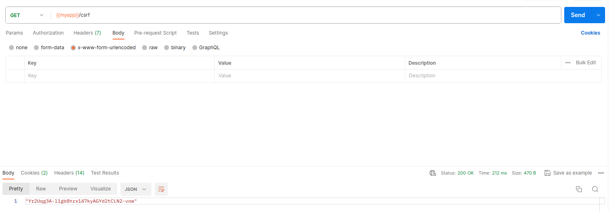
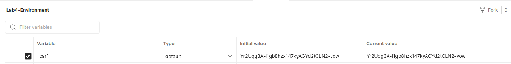

# lab_4_backend
> Student: Котенко Ярослав

> Group: IM-13

### Attached a file with environment variables to the classroom.

### To work with postman
Since I added csrf token, to work correctly with the postman, you need to manually get a new csrf token.



Then replace the old token in Environment with the new one you received.



## Instruction

### Docker-compose

To run the application, you need to open the terminal in the directory with the application. Then, in order to build the project, you need to enter:
```
$ docker compose build
```
in the terminal.

After the project is built then to start you need to enter:
```
$ docker compose up
```
or
```
$ docker compose up -d

```

To check the application, click on the link:
 
[http://localhost:3000/](http://localhost:3000/)


### Docker

If you want to run the project without using "docker-compose" then you can do this:

Create an image first. To do this, you need to enter: 
```
$ docker build -t lab-4 . 
```
in the terminal.

Then run the container: 
```
$ docker run -d -p 3000:3000 --env-file .env --name app --rm lab-4
```

To check the application, click on the link:
 
[http://localhost:3000/](http://localhost:3000/)

To stop the container, type: 
```
$ docker stop app
```
